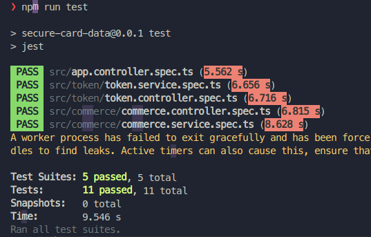
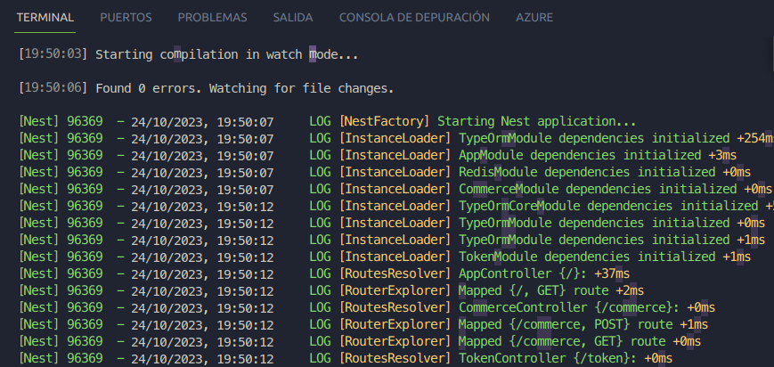
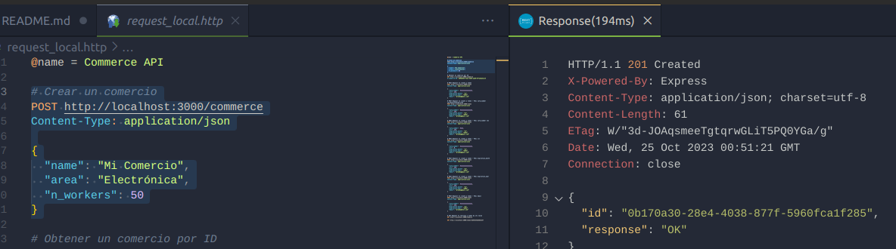
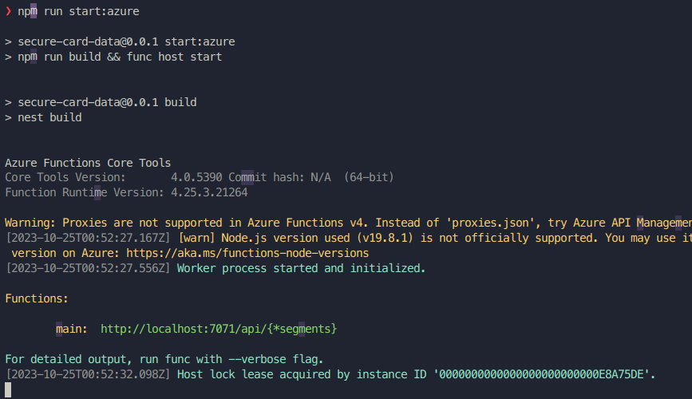
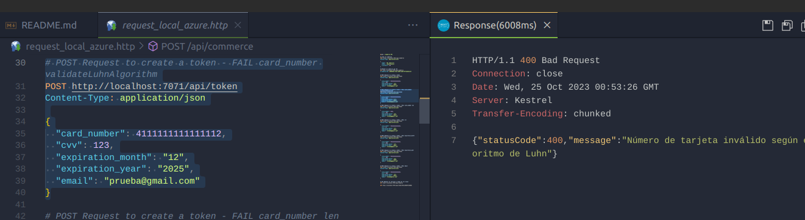

# Secure Card Data Project 🛡️

🚀 **¡Prueba la aplicación desplegada en Azure Functions!** [Demo](https://cwiki-azure-function.azurewebsites.net/)

El proyecto Secure Card Data es una aplicación basada en Nest.js que proporciona métodos para gestionar datos de tarjetas de forma segura. Este README te guiará a través de los pasos para ejecutar el proyecto en un entorno local y utilizar los comandos de npm disponibles.

## Instrucciones de Ejecución

1. **Compilación de TypeScript y Generación del Build**

   Para compilar TypeScript y generar el build de la aplicación que expondrá los métodos utilizados en las Azure Functions, utiliza el siguiente comando:

   ```bash
   npm run build
   ```

2. **Levantar la Aplicación en Modo de Desarrollo**

   Utiliza el siguiente comando para iniciar la aplicación en modo de desarrollo:

   ```bash
   npm run start:dev
   ```

3. **Ejecución de Pruebas en un Entorno Local**

   Puedes ejecutar las pruebas de la aplicación en un entorno local con el siguiente comando:

   ```bash
   npm run test
   ```

4. **Ejecución de las Azure Functions en Local**

   Para ejecutar las Azure Functions localmente, utiliza el siguiente comando:

   ```bash
   npm run start:azure
   ```

## Solicitudes de Ejemplo

### Commerce API

#### Crear un Comercio

```http
POST http://localhost:3000/commerce
Content-Type: application/json

{
  "name": "Mi Comercio",
  "area": "Electrónica",
  "n_workers": 50
}
```

#### Obtener un Comercio por ID

```http
GET http://localhost:3000/commerce
X-commerce-ID: b698e944-f2e1-4b95-aed9-67faeba3ac14
```

### Token API

#### Crear un Token

```http
POST http://localhost:3000/token
Content-Type: application/json

{
  "card_number": 4111111111111111,
  "cvv": 123,
  "expiration_month": "12",
  "expiration_year": "2025",
  "email": "prueba@gmail.com"
}
```

#### Obtener un Token por ID

```http
GET http://localhost:3000/token/641ce5824713b6b1
```

## Stack Utilizado 🛠️

- Azure Functions
- Redis
- SQL Server
- Nest.js
- Jest

¡Listo! Ahora puedes ejecutar tu proyecto Secure Card Data en un entorno local y utilizar los comandos proporcionados. Siéntete libre de personalizar este README según las necesidades específicas de tu proyecto.

## Capturas de Pantalla

#### Pruebas unitarias

<div align="center">
    
</div>

#### Ejecución en local

<div align="center">
    
</div>

<div align="center">
    
</div>

#### Ejecución en local - Azure Function

<div align="center">
    
</div>

<div align="center">
    
</div>

## Contribuir

Si deseas contribuir a este proyecto, ¡estamos abiertos a colaboraciones! Siéntete libre de enviar pull requests.
