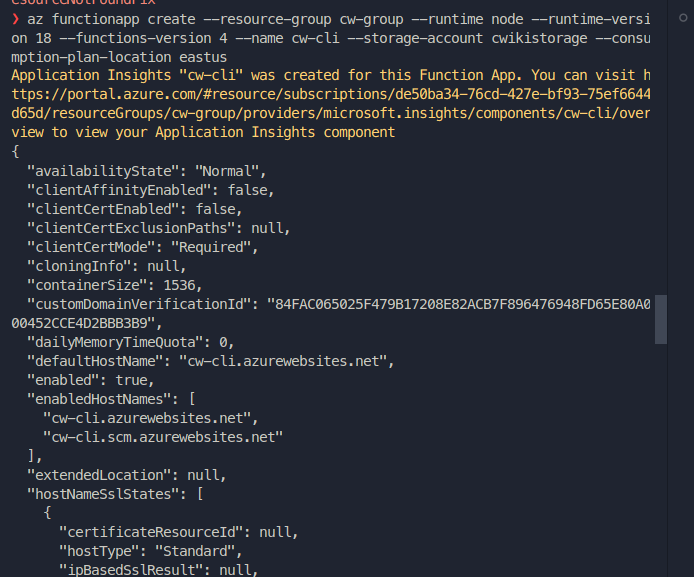

# Secure Card Data Project 🛡️

🚀 **¡Prueba la aplicación desplegada en Azure Functions!** [Demo](https://cw-cli.azurewebsites.net/api)

El proyecto Secure Card Data es una aplicación basada en Nest.js que proporciona métodos para gestionar datos de tarjetas de forma segura. Este README te guiará a través de los pasos para ejecutar el proyecto en un entorno local y utilizar los comandos de npm disponibles.

## Instrucciones de Ejecución

1. **Configuración del archivo .env**

   Crea un archivo llamado .env en la raíz de tu proyecto y configura las variables de entorno necesarias. Asegúrate de reemplazar los valores en blanco con tus propias configuraciones. Aquí tienes un ejemplo:

   ```plaintext
   Copy code
   REDIS_URL=
   SQL_SERVER_HOST=
   SQL_SERVER_USER=
   SQL_SERVER_PWD=
   SQL_SERVER_DB=
   ```

   Añade las URLs y credenciales correspondientes para la base de datos SQL Server y Redis, según sea necesario para tu aplicación.

2. **Compilación de TypeScript y Generación del Build**

   Para compilar TypeScript y generar el build de la aplicación que expondrá los métodos utilizados en las Azure Functions, utiliza el siguiente comando:

   ```bash
   npm run build
   ```

3. **Levantar la Aplicación en Modo de Desarrollo**

   Utiliza el siguiente comando para iniciar la aplicación en modo de desarrollo:

   ```bash
   npm run start:dev
   ```

4. **Ejecución de Pruebas en un Entorno Local**

   Puedes ejecutar las pruebas de la aplicación en un entorno local con el siguiente comando:

   ```bash
   npm run test
   ```

5. **Ejecución de las Azure Functions en Local**

   Para ejecutar las Azure Functions localmente, utiliza el siguiente comando:

   ```bash
   npm run start:azure
   ```

6. **Creación de la Función Azure (Reemplaza con tus valores)**

   Para crear una función Azure, utiliza el siguiente comando, reemplazando los valores de las variables con los adecuados:

   ```bash
   az functionapp create --resource-group <nombre-del-grupo-de-recursos> --runtime node --runtime-version 18 --functions-version 4 --name <nombre-de-la-funcion-azure> --storage-account <nombre-de-la-cuenta-de-almacenamiento> --consumption-plan-location <ubicacion-del-plan-de-consumo>
   ```

7. **Despliegue de la Función Azure (Reemplaza con tus valores)**

   Para desplegar la función Azure, utiliza el siguiente comando, reemplazando los valores de las variables con los adecuados:

   ```bash
   func azure functionapp publish <nombre-de-la-funcion-azure>
   ```

Asegúrate de reemplazar `<nombre-del-grupo-de-recursos>`, `<nombre-de-la-funcion-azure>`, `<nombre-de-la-cuenta-de-almacenamiento>` y `<ubicacion-del-plan-de-consumo>` con los valores correspondientes en tu configuración de Azure.

## Solicitudes de Ejemplo

Para poder realizar las pruebas de request puede usar Postman o [REST Client](https://marketplace.visualstudio.com/items?itemName=humao.rest-client) de VScode. A continuación algunos ejemplos:

### Commerce API

#### Crear un Comercio

```http
POST http://localhost:3000/commerce
Content-Type: application/json

{
  "name": "Mi Comercio",
  "area": "Electrónica",
  "n_workers": 50
}
```

#### Obtener un Comercio por ID

```http
GET http://localhost:3000/commerce
X-commerce-ID: b698e944-f2e1-4b95-aed9-67faeba3ac14
```

### Token API

#### Crear un Token

```http
POST http://localhost:3000/token
Content-Type: application/json

{
  "card_number": 4111111111111111,
  "cvv": 123,
  "expiration_month": "12",
  "expiration_year": "2025",
  "email": "prueba@gmail.com"
}
```

#### Obtener un Token por ID

```http
GET http://localhost:3000/token/641ce5824713b6b1
```

## Stack Utilizado 🛠️

- Azure Functions
- Redis (Render)
- SQL Server (Azure)
- Nest.js
- Jest

## Capturas de Pantalla

#### Pruebas unitarias

<div align="center">
    
</div>

#### Ejecución en local

<div align="center">
    
</div>

<div align="center">
    
</div>

#### Ejecución en local - Azure Function

<div align="center">
    
</div>

<div align="center">
    
</div>

#### Ejecución en la nube - Azure Function

Creación de la Azure Function

<div align="center">
    
</div>

Deploy

<div align="center">
    
</div>

Página de inicio

<div align="center">
    
</div>

Creación en la página de Azure

<div align="center">
    
</div>

Prueba de ejemplo

<div align="center">
    
</div>

Logs en tiempo real

<div align="center">
    
</div>

¡Listo! Ahora puedes ejecutar tu proyecto Secure Card Data en un entorno local y utilizar los comandos proporcionados. Siéntete libre de personalizar este README según las necesidades específicas de tu proyecto.

## Contribuir

Si deseas contribuir a este proyecto, ¡estamos abiertos a colaboraciones! Siéntete libre de enviar pull requests.
